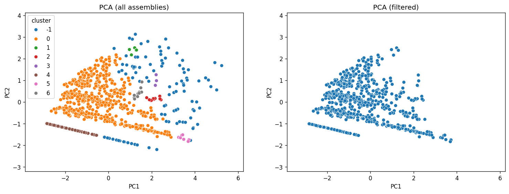

   
# Samplaction
CLI tool for assessing the homogeneity of genome assembly datasets using assembly quality metrics.

Samplaction helps generate a homogeneous subset of assemblies suitable for downstream comparative genomics analysis.
## Synopsis
Modern comparative genomics projects often begin with hundreds of genome assemblies. Such datasets frequently contain:
- fragmented assemblies
- assemblies with unusually large or small genome sizes
- samples with excessive contig counts
- assemblies that strongly deviate from the rest of the dataset

Therefore, the first step in many studies is filtering assemblies to create a homogeneous dataset. Samplaction's aim is to automate this step based on assembly statistics (`seqkit stats`). 
Using these statistics, it performs::
- heuristic QC filtering
- PCA dimensionality reduction
- DBSCAN clustering for outlier detection

## Filtering strategy
Samplaction performs sample filtering in several consecutive stages.

The goal is to remove assemblies that strongly deviate from the main dataset before clustering.

### 0. Assembly statistics extraction
Assembly statistics are calculated using:
```commandline
$ seqkit stats -a *.fasta > assembly_stats.tsv
```
| Metric | Description |
|------|-------------|
| num_seqs | number of contigs |
| sum_len | total assembly length |
| N50 | N50 contig length |
| max_len | length of the longest contig |


### 1. Threshold-based filtering
First, obvious outliers are removed using simple heuristic rules. Assemblies are retained only if they satisfy the following conditions. 
Assemblies that do not meet these criteria are removed:
- `num_seqs` < `threshold_num_seqs`
- `N50` > `threshold_n50`
- genome size within ±20% of the expected genome size

If the expected genome size is not provided, it is estimated **as the mean assembly length** of the dataset.

Additionally, percentile-based filtering is applied:
- assemblies with `N50` outside the 5–95% range
- assemblies with `num_seqs` above the 95th percentile

This stage removes assemblies that are clearly inconsistent with the rest of the dataset.

### 2. Quality score filtering
To further reduce low-quality assemblies, a simple composite quality score is calculated:
```
quality_score = z(N50) + z(max_len) − z(num_seqs)
```
where `z()` denotes **z-score normalization**.
Assemblies in the lowest 10% of quality scores are removed.

### 3. PCA projection
Remaining assemblies are projected into a lower-dimensional space using PCA.

The default metrics used for PCA are: `N50`, `sum_len`, `num_seqs`, `max_len`. Metrics are standardized before PCA.

The set of metrics used for PCA can be modified via the CLI.

### 4. DBSCAN clustering
Outlier detection is performed using DBSCAN clustering in PCA space.
Assemblies assigned to cluster `-1` are considered outliers.

DBSCAN default params are: `eps = 0.8`, `min_samples = 5`. These parameters can be modified via CLI arguments.

### 5. Summarise
Assemblies that:
- pass threshold-based filtering 
- pass quality score filtering
- are not classified as DBSCAN outliers

are included in the final dataset.

## Installation
Clone the repository and install the tool:
```commandline
$ git clone https://github.com/pour221/samplaction.git
$ cd samplaction
$ pip install -e .
```

Python packages required:
- pandas
- scikit-learn
- seaborn
- matplotlib

External tool:
- `seqkit`

Make sure `seqkit` is available in your `PATH`.

Alternatively, the tool can use a table generated by `seqkit stats -a`.


## Usage
Samplaction can work with either:
- a directory containing genome assemblies (FASTA files), or
- a precomputed `seqkit stats -a` table.

```commandline
usage: samplaction [-h] [--version] -i INPUT -o OUTPUT_FILE [-s SIZE] [--max_num_seqs MAX_NUM_SEQS]
                   [--min_n50 MIN_N50] [--metrics METRICS] [--eps EPS] [--min_samples MIN_SAMPLES]

CLI tool for filtering genomic assemblies outliers based on seqkit metrics

options:
  -h, --help            show this help message and exit
  --version             show program's version number and exit
  -i INPUT, --input INPUT
                        tsv file with assembly stats (output from seqkit stats -a) or path to folder with
                        genomes to run seqkit
  -o OUTPUT_FILE, --output_file OUTPUT_FILE
                        path to store result table with selected samples
  -s SIZE, --size SIZE  The reference (or approximate) genome size in bp (e.g., 6000000). If not specified,
                        the average value based on the table will be used.
  --max_num_seqs MAX_NUM_SEQS
                        Threshold for num_seqs metric to drop. Default=1000
  --min_n50 MIN_N50     Threshold for N50 metric to drop. Default=5000
  --metrics METRICS     Space-separated list of metrics used for PCA. Default: "N50 sum_len num_seqs max_len"
  --eps EPS             EPS for DBSCAN
  --min_samples MIN_SAMPLES
                        Minimum samples for DBSCAN cluster
```
### Examples
- Run on genome assemblies without any additional params:
```commandline
$ samplaction -i path/to/folder/with/fasta/files -o /path/to/outfile/with/filtering/samples.csv
```
- Run on precomputed quality table with specified genome size:
```commandline
$ samplaction -i path/to/table/with/quality/metrics.tsv -o /path/to/outfile/with/filtering/samples.csv -s 6500000
```

You can manually select threshold for number of contigs (using `--max_num_seqs`) and N50 contig length (using `--min_n50`)
For PCA you can select needed metrics (using `--metrics`). Additionally, you can change DBSCAN clusterization params: DBSCAN epsilon parameter and minimum cluster size
(using `--eps` and `--min_samples`). For instance:
```commandline
$ samplaction -i metrics.tsv -o samples.csv --max_num_seqs 2000 --min_n50 3000 --metrics "N50 sum_len num_seqs max_len GC(%)" --eps 0.9 --min_samples 4
```
### Output
Samplaction produces three outputs. If you specify `-o` as `selected_samples.csv`:
The main output is filtered samples table - `selected_samples.csv` - samples that remained in the final sample.
And two additional outputs: full dataset with cluster labels (`selected_samples_all_samples.csv`). Contains all samples and additional columns: DBSCAN cluster and selected (whether the sample passed filtering);
PCA visualization (`selected_samples.png`) - plots with two panel. Left panel: PCA projection of all assemblies. Right panel: retained assemblies after filtering

Plot example:

### Limitations
Samplaction uses heuristic filtering and unsupervised clustering.

The results should be interpreted as guidance for dataset QC, not as a definitive assessment of assembly quality.

## Test data
Samplaction was tested on a random subset of *E. coli* genome assemblies. All genomes used for testing were obtained from NCBI GenBank and are publicly available.
